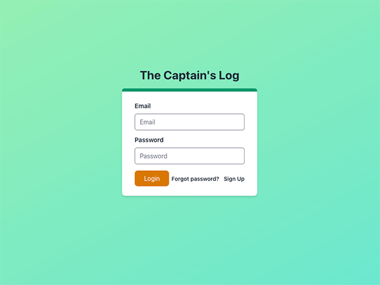
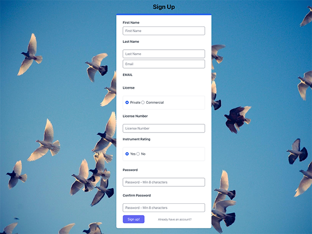
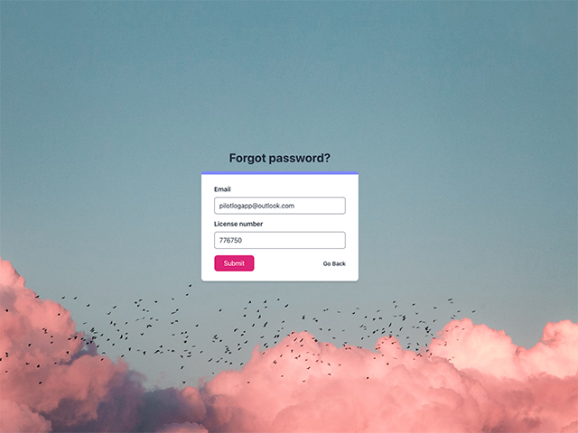
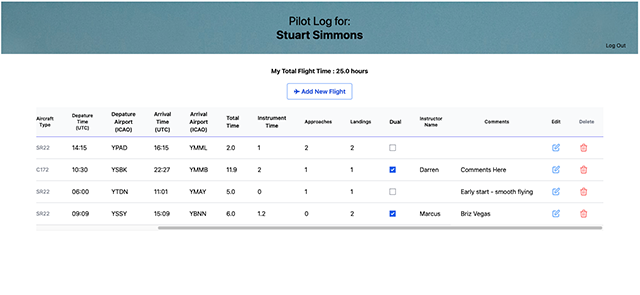
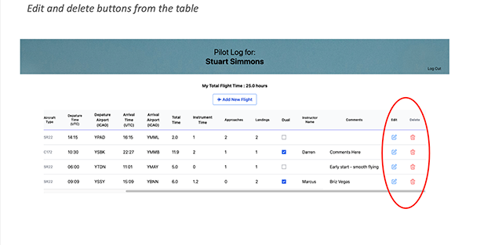
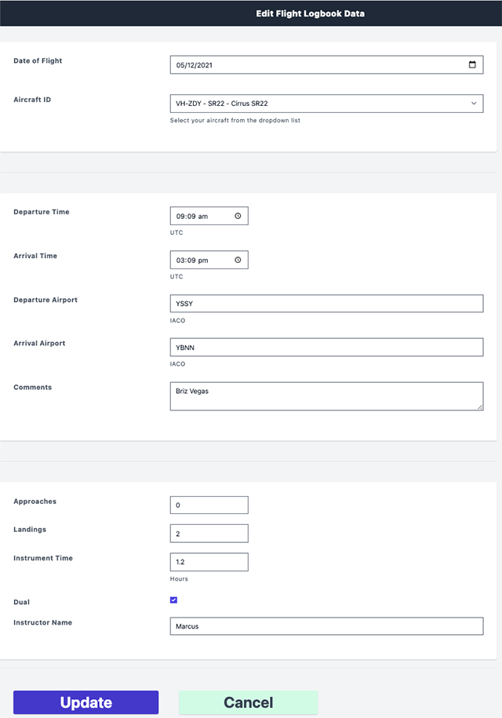

# README - PILOT LOG

[](https://opensource.org/licenses/MIT)

## Link to see the deployed application:

[DEPLOYED APPLICATION Flight logs](https://proje-2.herokuapp.com/) 

## Link to presentation Walkthrough of the application [Flight Logs](https://docs.google.com/presentation/d/1VkCxlMfzRDLJgDulqRDW2buKqhcXd89twEXsXEmm7VA/edit?usp=sharing)


## Description  

An easy-to-use web-based application to record pilot’s flight times.  
Record departure and arrival airports and time and automatically calculate flight time.  
Record each flight against a specific aircraft type and registration id.  
Secure login and once you have been logged in, stay logged in until your session expires or you logout  
  

  
Packages/libraries used for this application:  
[Bcrypt](https://www.npmjs.com/package/bcrypt)  
[Connect-session-sequelize](https://www.npmjs.com/package/connect-session-sequelize)  
[date-fns](https://date-fns.org/)  
[dotenv](https://www.npmjs.com/package/dotenv)  
[Express](https://www.npmjs.com/package/express)  
[Express-handlebars](https://www.npmjs.com/search?q=express%20handlebars)  
[Express-session](https://www.npmjs.com/package/express-session)  
[MySQL2](https://www.npmjs.com/package/mysql2)  
[Nodemailer](https://nodemailer.com/about/)  
[Sequilize](https://sequelize.org/)  
[tailwindcss](https://tailwindcss.com/)

## Table of contents:

1. [Installation](#installation)
2. [Usage](#usage)
3. [License](#license)
4. [Contributing](#contributing)
5. [Collaborators & Questions](#Collaborators/Questions)

## Installation

1. Fork repository
2. Clone repository to local environment.
3. Node.js must be installed.
4. To install all the dependencies (bcrypt, connect-session-sequelize, date-fns, dotenv, express, express-handlebars, express-session, mysql2, sequilize, tailwindcss) use the following command:

```bash
npm install
```

## Usage  
When you first visit the app, you will be presented with a typical login screen.  
We have included options to signup, login or forgotten password.  
You will be automatically signed out after 5 minutes of idle time.  

### Login page



### SignUp page



### Forgot Password Page



## After Login, Redirection to the Dashboard:

### Dashboard



### Add Logbook Entry:


### Edit 





## Links  
Github link: [Flight Logs Github repository](https://github.com/ausamindec)
  
## License  

This project is covered under the MIT license.
[License](https://github.com/ausamindec/flightLogs/blob/main/LICENSE)

MIT License

Copyright (c) 2022 Aminul Hoque

Permission is hereby granted, free of charge, to any person obtaining a copy
of this software and associated documentation files (the "Software"), to deal
in the Software without restriction, including without limitation the rights
to use, copy, modify, merge, publish, distribute, sublicense, and/or sell
copies of the Software, and to permit persons to whom the Software is
furnished to do so, subject to the following conditions:

The above copyright notice and this permission notice shall be included in all
copies or substantial portions of the Software.

THE SOFTWARE IS PROVIDED "AS IS", WITHOUT WARRANTY OF ANY KIND, EXPRESS OR
IMPLIED, INCLUDING BUT NOT LIMITED TO THE WARRANTIES OF MERCHANTABILITY,
FITNESS FOR A PARTICULAR PURPOSE AND NONINFRINGEMENT. IN NO EVENT SHALL THE
AUTHORS OR COPYRIGHT HOLDERS BE LIABLE FOR ANY CLAIM, DAMAGES OR OTHER
LIABILITY, WHETHER IN AN ACTION OF CONTRACT, TORT OR OTHERWISE, ARISING FROM,
OUT OF OR IN CONNECTION WITH THE SOFTWARE OR THE USE OR OTHER DEALINGS IN THE
SOFTWARE.